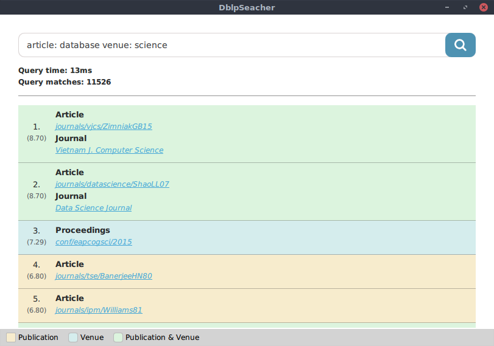

Dblp Searcher
====

Indexer and query resolver of a mini language over the DBLP's dumps (dblp.xml).

## REQUIREMENTS

* make
* qmake (qt5-make)
* Qt5 (libqt5...)
* openmp (libgomp)
* Qt5 GUI (qtdeclarative5-dev, qt5-quickcontrols2)

## COMPILE

```
./build.sh
```

Which actually does the following:

```
rm -rf build
mkdir build
cd build
../makepri.sh
qmake ../DblpSearcher.pro
make -j8
```

A binary file (`DblpSearcher`) will be created under the `build` directory.

Copy to binary to your path or `cd` to `build` for follow the documentation.

## USAGE

```
NAME
	dblp-searcher

SYNOPSIS
	dblp-searcher <MODE> <INDEX_FOLDER_PATH> <INDEX_BASE_NAME> [OPTIONS]...

DESCRIPTION
	Perform full-text searches over the dblp.xml dump of DBLP.
	This program can be launched in two different mode:
	1) Index creation: parses the dblp.xml and creates the index files from it
	2) Search: open the GUI for perform searches over the previously created
			   index files

INDEX MODE
	--index, -I <dblp_file_path> <index_folder_path> <index_base_name>
		Starts in index creation mode.
		Requires two additional arguments, the path where to place the index
		files and the base name to use for the index files.
		e.g. --index /tmp/dblp.xml /tmp/dblp-index/ indexname

SEARCH MODE
	--search, -S <index_folder_path> <index_base_name>
		Starts the GUI in search mode.
		Requires two additional arguments, the path where to load the index
		files and the base name of those.
		e.g. --search /tmp/dblp-index/ indexname

	OPTIONALS
		--xml, -X <dblp_xml_file>
		Use the original XML for show the original XML content of the query matches.
		Must obviously be the same file used for the indexing.


SEARCH MODE LANGUAGE
	The following mini language is supported by the query resolver:
	
	f-t-s: ([element-field:] search-pattern)+
	search-pattern: term | "phrasal terms"
	element-field: publication-search | venue-search
	publication-search : publication-element[.publication-field]
	publication-element: publication | article | incollection | inproc | phThesis | masterThesis
	publication-field: author | title | year
	venue-search: venue[.venue-field]
	venue-field: title | publisher

	e.g.
	1. information retrieval
	2. "information retrieval"
	3. article: data science
	4. incollection.title: "database logic"
	5. article: science venue.title: springer

```

### Indexing

First of all a valid dblp.xml file should be downloaded from the 
[DBLP page](https://dblp.uni-trier.de/xml/).

Therefore starts the binary in index mode in order to index the dblp.xml file.

e.g. ./DblpSearcher --index /tmp/dblp.xml /tmp/dblp-index/ myindex

### Searching

After the creation of the indexes files, the application can be started in search
mode.

e.g. ./DblpSearcher --search /tmp/dblp-index/ myindex

The queries should be conform to the language expressed in the USAGE section.




## LICENSE

DblpSearcher is [MIT licensed](./LICENSE).
